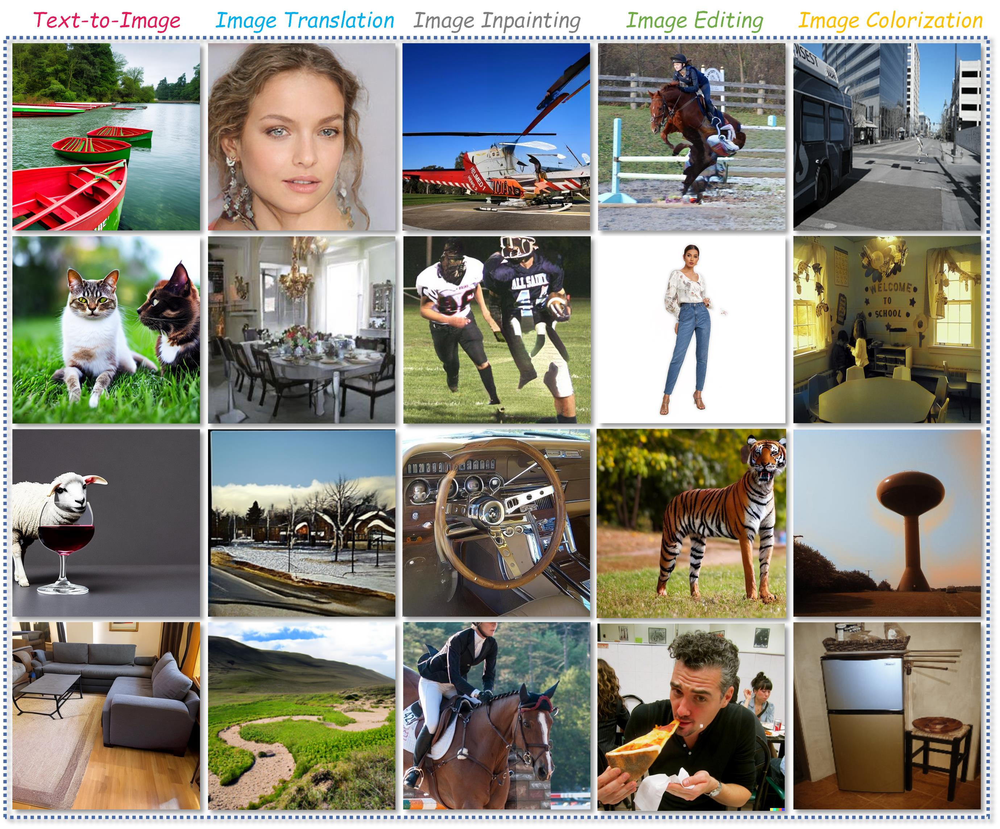

# Awesome-AI-Generated-Image-Tasks

 

A collection of **AI-generated images** papers and corresponding source code/demo program, including text-to-image, image translation (*e.g.*, text-, image, or other multimodality-guided), image inpainting, image colorization, and image editing.

> Feel free to create a PR or an issue.  (Pull Request is preferred)

**Outline**

- [Awesome-AI-Generated-Image-Tasks](#awesome-ai-generated-image-tasks)
  - [1. Text-to-Image](#1-text-to-image)
  - [2. Image Translation](#2-image-translation)
  - [3. Image Inpainting](#3-image-inpainting)
  - [4. Image Colorization](#4-image-colorization)
  - [5. Image Editing](#5-image-editing)

---

## 1. Text-to-Image

| Paper | Source | Code/Project Link |
|---|---|---|
|[ High-Resolution Image Synthesis with Latent Diffusion Models](https://arxiv.org/abs/2112.10752)| CVPR 2022 |[[project]](https://ommer-lab.com/research/latent-diffusion-models/) [[code]](https://github.com/CompVis/stable-diffusion)|
|[Photorealistic Text-to-Image Diffusion Models with Deep Language Understanding](https://proceedings.neurips.cc/paper_files/paper/2022/hash/ec795aeadae0b7d230fa35cbaf04c041-Abstract-Conference.html)|NeurIPS 2022|[[code]](https://github.com/lucidrains/imagen-pytorch)|
|[GLIDE: towards photorealistic image generation and editing with text-guided diffusion models](https://arxiv.org/abs/2112.10741)|ICML 2022|[[code]](https://github.com/openai/glide-text2im)|
|[LAFITE: Towards language-free training for text-to-image generation](https://arxiv.org/abs/2111.13792)|CVPR 2022|[[code]](https://github.com/drboog/Lafite)|
|[Subject-diffusion: Open domain personalized text-to-image generation without test-time fine-tuning](https://arxiv.org/abs/2307.11410)   |arxiv 2023|[[project]](https://oppo-mente-lab.github.io/subject_diffusion/) [[code]](https://github.com/OPPO-Mente-Lab/Subject-Diffusion)|
|[BoxDiff: Text-to-Image Synthesis with Training-Free Box-Constrained Diffusion](https://arxiv.org/abs/2307.10816)|ICCV 2023|[[code]](https://github.com/showlab/BoxDiff)|
|[Adding Conditional Control to Text-to-Image Diffusion Models](https://arxiv.org/abs/2302.05543)|ICCV 2023|[[code]](https://github.com/lllyasviel/ControlNet)|

## 2. Image Translation

| Paper | Source | Code/Project Link |
|---|---|---|
|[Unpaired Image-to-Image Translation using Cycle-Consistent Adversarial Networks](https://arxiv.org/pdf/1703.10593.pdf)|ICCV 2017|[[project]](https://junyanz.github.io/CycleGAN/) [[code]](https://github.com/junyanz/pytorch-CycleGAN-and-pix2pix)|
|[Image-to-Image Translation with Conditional Adversarial Networks](https://arxiv.org/pdf/1611.07004.pdf)|CVPR 2017|[[project]](https://phillipi.github.io/pix2pix/) [[code]](https://github.com/junyanz/pytorch-CycleGAN-and-pix2pix)|
|[DeepFaceDrawing: Deep generation of face images from sketches](https://dl.acm.org/doi/abs/10.1145/3386569.3392386)   |SIGGRAPH/TOG 2020 |[[project]](http://www.geometrylearning.com/DeepFaceDrawing/) [[code]](https://github.com/IGLICT/DeepFaceDrawing-Jittor) |
|[CoCosNet: Cross-domain Correspondence Learning for Exemplar-based Image Translation](https://arxiv.org/abs/2004.05571)|CVPR 2020|[[project]](https://panzhang0212.github.io/CoCosNet/) [[code]](https://github.com/microsoft/CoCosNet)|
|[CoCosNet v2: Full-Resolution Correspondence Learning for Image Translation](https://openaccess.thecvf.com/content/CVPR2021/html/Zhou_CoCosNet_v2_Full-Resolution_Correspondence_Learning_for_Image_Translation_CVPR_2021_paper.html)|CVPR 2021|[[code]](https://github.com/microsoft/CoCosNet-v2)|
|[StyleCLIP: Text-Driven Manipulation of StyleGAN Imagery](https://arxiv.org/abs/2011.12799)|ICCV 2021|[[code]](https://github.com/orpatashnik/StyleCLIP)|
|[Encoding in Style: a StyleGAN Encoder for Image-to-Image Translation](https://arxiv.org/abs/2008.00951)|CVPR 2021|[[code](https://github.com/eladrich/pixel2style2pixel)]|
|[RABIT: Bi-level Feature Alignment for Versatile Image Translation and Manipulation](https://link.springer.com/chapter/10.1007/978-3-031-19787-1_13)|ECCV 2022|[[code]](https://github.com/fnzhan/RABIT)|
|[DynaST: Dynamic Sparse Transformer for Exemplar-Guided Image Generation](https://arxiv.org/abs/2207.06124)|ECCV 2022|[[code]](https://github.com/Huage001/DynaST)|
|[DiffusionCLIP: Text-Guided Diffusion Models for Robust Image Manipulation](https://openaccess.thecvf.com/content/CVPR2022/html/Kim_DiffusionCLIP_Text-Guided_Diffusion_Models_for_Robust_Image_Manipulation_CVPR_2022_paper.html)|CVPR 2022|[[code]](https://github.com/gwang-kim/DiffusionCLIP)|
|[CLIP-PAE: Projection-Augmentation Embedding to Extract Relevant Features for a Disentangled, Interpretable and Controllable Text-Guided Face Manipulation](https://dl.acm.org/doi/abs/10.1145/3588432.3591532)|SIGGRAPH 2023|[[project]](https://chenliang-zhou.github.io/CLIP-PAE/) [[code]](https://github.com/Chenliang-Zhou/CLIP-PAE)|
|[Masked and Adaptive Transformer for Exemplar Based Image Translation](https://openaccess.thecvf.com/content/CVPR2023/html/Jiang_Masked_and_Adaptive_Transformer_for_Exemplar_Based_Image_Translation_CVPR_2023_paper.html)|CVPR 2023|[[code]](https://github.com/AiArt-HDU/MATEBIT)|
|[Diffusion-based Image Translation using Disentangled Style and Content Representation](https://arxiv.org/abs/2209.15264)|ICLR 2023|[[code]](https://github.com/cyclomon/DiffuseIT)|

## 3. Image Inpainting
| Paper | Source | Code/Project Link |
|---|---|---|
|[RePaint: Inpainting using Denoising Diffusion Probabilistic Models](https://arxiv.org/abs/2201.09865)|CVPR 2022|[[code]](https://github.com/andreas128/RePaint)  |
|[MAT: Mask-Aware Transformer for Large Hole Image Inpainting](https://arxiv.org/abs/2203.15270)   |CVPR 2022|[[code]](https://github.com/fenglinglwb/MAT)|
|[Imagen Editor and EditBench: Advancing and Evaluating Text-Guided Image Inpainting](https://openaccess.thecvf.com/content/CVPR2023/papers/Wang_Imagen_Editor_and_EditBench_Advancing_and_Evaluating_Text-Guided_Image_Inpainting_CVPR_2023_paper.pdf)|CVPR 2023|[[project]](https://imagen.research.google/editor/)|
|[SmartBrush: Text and Shape Guided Object Inpainting with Diffusion Model ](https://openaccess.thecvf.com/content/CVPR2023/papers/Xie_SmartBrush_Text_and_Shape_Guided_Object_Inpainting_With_Diffusion_Model_CVPR_2023_paper.pdf)|CVPR 2023|Not open-sourced|

## 4. Image Colorization
| Paper | Source | Code/Project Link |
|---|---|---|
|[Disentangled Image Colorization via Global Anchors]()|SIGGRAPH Asia/TOG 2022|[[project]](https://menghanxia.github.io/projects/disco.html) [[code]](https://github.com/MenghanXia/DisentangledColorization) [[demo]](https://huggingface.co/spaces/menghanxia/disco)|
|[BigColor:Colorization using a Generative Color Prior for Natural Images](https://link.springer.com/chapter/10.1007/978-3-031-20071-7_21)|ECCV 2022|[[code]](https://github.com/KIMGEONUNG/BigColor)|
|[Unsupervised Deep Exemplar Colorization via Pyramid Dual Non-local Attention](https://ieeexplore.ieee.org/abstract/document/10183846)|TIP 2023|[[code]](https://github.com/wd1511/PDNLA-Net)|
|[DDColor: Towards Photo-Realistic Image Colorization via Dual Decoders](https://arxiv.org/abs/2212.11613)   |ICCV 2023|[[code]](https://github.com/piddnad/DDColor) [[demo]](https://modelscope.cn/models/damo/cv_ddcolor_image-colorization/summary)  |

## 5. Image Editing
| Paper | Source | Code/Project Link |
|---|---|---|
|[User-Controllable Latent Transformer for StyleGAN Image Layout Editing](https://onlinelibrary.wiley.com/doi/abs/10.1111/cgf.14686?casa_token=Q40TD0-9wLEAAAAA:kqIWCVsfWDQ20tR5FVarsUn9Qqix-Y6YwrHcgGk1bq-_5LP48qYbTXiXOws1WfCjhzEbFFBkOlemnojn)|Computer Graphics Forum 2022|[[code]](https://github.com/endo-yuki-t/UserControllableLT)|
|[InstructPix2Pix: Learning to Follow Image Editing Instructions](http://openaccess.thecvf.com/content/CVPR2023/html/Brooks_InstructPix2Pix_Learning_To_Follow_Image_Editing_Instructions_CVPR_2023_paper.html) |CVPR 2023 |[[code]](https://github.com/xuduo35/InstructPix2Pix)|
|[MagicBrush: A Manually Annotated Dataset for Instruction-Guided Image Editing](https://arxiv.org/abs/2306.10012)   |NeurIPS 2023  |[[project]](https://osu-nlp-group.github.io/MagicBrush/) [[code]](https://github.com/OSU-NLP-Group/MagicBrush)|
|[Diffusion Self-Guidance for Controllable Image Generation](https://arxiv.org/abs/2306.00986)|NeurIPS 2023|[[project]](https://dave.ml/selfguidance/) [[demo]](https://colab.research.google.com/drive/1SEM1R9mI9cF-aFpqg3NqHP8gN8irHuJi?usp=sharing)|
|[Drag Your GAN: Interactive Point-based Manipulation on the Generative Image Manifold]()   |SIGGRAPH 2023 |[[project]](https://vcai.mpi-inf.mpg.de/projects/DragGAN/) [[code]](https://github.com/XingangPan/DragGAN) |
|[DragDiffusion: Harnessing Diffusion Models for Interactive Point-based Image Editing](https://arxiv.org/abs/2306.14435)   |arxiv 2023 |[[code]](https://github.com/Yujun-Shi/DragDiffusion)   |
|[DragonDiffusion: Enabling Drag-style Manipulation on Diffusion Models](https://arxiv.org/abs/2307.02421)|arxiv 2023  |[[project]](https://mc-e.github.io/project/DragonDiffusion/) [[code]](https://github.com/MC-E/DragonDiffusion)  |
|[FreeDrag: Point Tracking is Not What You Need for Interactive Point-based Image Editing](https://arxiv.org/abs/2307.04684)   |arxiv 2023  |[[project]](https://lin-chen.site/projects/freedrag/) [[code]](https://github.com/LPengYang/FreeDrag) [[demo]](https://openxlab.org.cn/apps/detail/LPengYang/FreeDrag)   |

